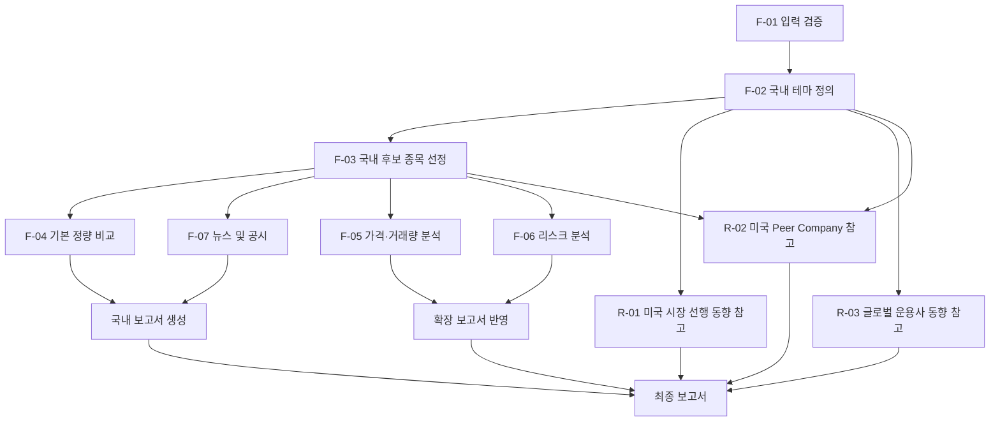

# 테마 주식 리서치 에이전트 MVP Plan

## 1. 문서 개요

이 문서는 기능 분해 명세를 실제 개발 작업 순서와 완료 기준으로 전환한 실행 계획서다. 핵심 목적은 국내(KRX) 테마 종목을 근거와 함께 찾고 비교하는 것이다. 미국 시장, 미국 Peer Company, 글로벌 운용사 자료는 국내 분석을 보완하는 **참고 정보**이며, 실패해도 국내 보고서 생성을 중단하지 않는다.

## 2. MVP 목표

사용자는 `theme`(테마 또는 국내 종목명)과 `top_n`을 입력해 다음 결과를 받는다.

- 국내 테마 정의와 포함 기준
- 근거가 확인된 KRX 보통주 후보
- 최근 종가·시가총액·기본 재무 지표 비교
- 최근 뉴스 및 공시, 출처, 투자자 보호 안내

확장 단계에서는 가격·거래량 분석과 리스크 요약을 추가한다. 해외 정보는 국내 결과를 보완하는 참고 섹션으로만 제공한다.

## 3. 범위 및 우선순위

| 구분 | 기능 | 단계 | 우선순위 |
| --- | --- | --- | --- |
| 필수 MVP | F-01 입력 검증 | Phase 1 | Must |
| 필수 MVP | F-02 국내 테마 정의 | Phase 1 | Must |
| 필수 MVP | F-03 국내 후보 종목 선정 | Phase 1 | Must |
| 필수 MVP | F-04 국내 기본 정량 비교 | Phase 1 | Must |
| 필수 MVP | F-07 최근 뉴스 및 공시 | Phase 1 | Must |
| 필수 MVP | 출처 관리·보고서 생성·안내 문구 | Phase 1 | Must |
| MVP 확장 | F-05 가격 및 거래량 분석 | Phase 2 | Should |
| MVP 확장 | F-06 상세 리스크 분석 | Phase 2 | Should |
| 후속 참고 기능 | R-01 미국 시장 선행 동향 | Phase 3 | Could |
| 후속 참고 기능 | R-02 관련 미국 Peer Company | Phase 3 | Could |
| 후속 참고 기능 | R-03 글로벌 운용사 동향 | Phase 3 | Could |

국내 필수 기능이 완료되기 전에는 참고 정보 기능을 개발 우선순위로 올리지 않는다.

## 4. 구현 단계

### Phase 1. 국내 리서치 핵심 MVP

입력 검증, 국내 테마 정의, 후보 선정, 기본 정량 비교, 뉴스·공시, 출처 및 기본 보고서를 구현한다. 완료 시 해외 참고 정보 없이도 독립적인 국내 리서치 보고서를 생성할 수 있어야 한다.

### Phase 2. 국내 분석 확장

동일 기간 기준의 가격·거래량 분석과 공개자료 기반 리스크 요약을 추가한다. 복잡한 예측, MDD, 고급 이상 탐지는 포함하지 않는다.

### Phase 3. 해외 참고정보 확장

미국 시장 선행 동향, 미국 Peer Company, 글로벌 운용사 동향을 각각 독립적으로 추가한다. 데이터 확보 실패나 제한 시간 초과 시 해당 참고 섹션만 `확인 가능한 자료 없음`으로 표시한다.

## 5. 작업 분해 구조

| 작업 ID | 작업명 | 대상 기능 | 목적 | 선행 작업 | 산출물 | 완료 조건 | 테스트 방법 | 우선순위 | 단계 |
| --- | --- | --- | --- | --- | --- | --- | --- | --- | --- |
| TASK-P1-01 | 기본 구조 구성 | 공통 | 책임 단위와 공통 규칙을 마련 | 없음 | 설정·로그·오류·모델·테스트 구조 | 외부 데이터 계층과 도메인 모델 위치가 분리됨 | 빈 요청 처리와 공통 오류 형식 확인 | Must | P1 |
| TASK-P1-02 | 입력 검증 | F-01 | 유효하지 않은 요청 차단 | P1-01 | 요청 검증 로직·오류 메시지 | 테마/종목명과 `top_n` 검증 완료 | 정상·빈값·형식 오류 테스트 | Must | P1 |
| TASK-P1-03 | 테마·종목 식별 | F-02 | 입력을 국내 리서치 기준으로 정규화 | P1-02 | 테마 정의·근거 연결 | 근거 있는 테마 정의 생성 | 테마/국내 종목명 입력 테스트 | Must | P1 |
| TASK-P1-04 | KRX 후보 탐색·필터 | F-03 | 적격 국내 후보 생성 | P1-03 | 후보 목록·선정 근거 | 보통주 후보 최대 `top_n`개 생성 | 제외 종목·후보 부족 테스트 | Must | P1 |
| TASK-P1-05 | 기본 시장·재무 수집 | F-04 | 비교 가능한 기본 지표 확보 | P1-04 | 지표 데이터·기준일·출처 | 누락값을 포함해 비교 데이터 생성 | 값 있음/없음·기준일 테스트 | Must | P1 |
| TASK-P1-06 | 뉴스·공시 수집 | F-07 | 종목별 최근 이슈 제공 | P1-04 | 1~3건 이슈 목록 | 중복 없는 이슈와 출처 생성 | 뉴스 없음·동일 사건 중복 테스트 | Must | P1 |
| TASK-P1-07 | 출처 관리 | 공통 | 주장·수치의 추적성 확보 | P1-03 | SourceRecord 관리 규칙 | 핵심 데이터에 출처 연결 | 출처 누락 품질 테스트 | Must | P1 |
| TASK-P1-08 | Phase 1 보고서 생성 | 공통 | 국내 보고서 조합 | P1-05~07 | Markdown 또는 구조화된 보고서 | 필수 7개 섹션 생성 | 전체 흐름 통합 테스트 | Must | P1 |
| TASK-P2-01 | 가격·거래량 분석 | F-05 | 동일 기준 가격 비교 추가 | P1-04 | 가격·거래량 지표 | 기준 기간·기준일 포함 결과 생성 | 시계열 부족·계산 테스트 | Should | P2 |
| TASK-P2-02 | 리스크 요약 | F-06 | 공개자료 기반 확인 항목 제공 | P1-04, P1-06, P1-07 | 리스크 항목 | 추천 없이 리스크·출처 생성 | 추천 표현 차단 테스트 | Should | P2 |
| TASK-P2-03 | 확장 보고서 반영 | F-05, F-06 | 국내 정량·리스크 섹션 확장 | P2-01~02 | 확장 보고서 | P2 결과가 국내 섹션에 반영됨 | 부분 데이터 통합 테스트 | Should | P2 |
| TASK-P3-01 | 미국 선행 동향 | R-01 | 전일 미국 테마 참고 정보 | P1-03 | 미국 동향 참조 | 자료 유무와 무관하게 국내 보고서 유지 | 미국 휴장·매핑 실패 테스트 | Could | P3 |
| TASK-P3-02 | 미국 Peer Company | R-02 | 비교 가능한 미국 기업 참고 | P1-03 또는 P1-04 | Peer 목록·근거 | 객관적 연결 근거와 라벨 생성 | Peer 없음·추천 표현 테스트 | Could | P3 |
| TASK-P3-03 | 운용사 동향 | R-03 | 공개 운용 자료 참고 | P1-03 | 운용사 참조 | 관련 공개자료만 표시 | 자료 없음·13F 기준일 테스트 | Could | P3 |
| TASK-P3-04 | 참고 섹션 조합 | R-01~03 | 참고 정보의 독립적 표시 | P3-01~03 | 최종 보고서 | 참고 실패가 국내 결과에 영향 없음 | 시간 초과·부분 실패 테스트 | Could | P3 |

## 6. Phase 1 실행 계획

### 6.1 프로젝트 기본 구조 — TASK-P1-01

| 항목 | 내용 |
| --- | --- |
| 입력 | 설정값, 분석 요청 |
| 주요 처리 | 프로젝트 디렉터리, 환경설정, 로그, 공통 오류 형식, 데이터 모델, 테스트 디렉터리, 외부 데이터 접근 계층의 책임을 분리한다. |
| 출력 | 공통 설정, 오류 객체, 로그 규칙, 데이터 접근 인터페이스 |
| 실패 시 대체 | 외부 데이터 제공처 구현 전에는 고정된 테스트 데이터로 후속 흐름을 검증한다. |

### 6.2 입력 검증 — TASK-P1-02

- `theme`의 필수 여부와 공백 문자열을 검증한다.
- `top_n`은 1~10 사이의 정수인지 검증한다. 기본값은 3개, 최대값은 외부 데이터 조회 시간과 보고서 가독성을 고려해 10개로 관리한다.
- 테마명과 국내 종목명 입력을 구분하고, 숫자만 입력·지나치게 포괄적인 표현·존재하지 않는 종목명은 수정 요청 대상으로 분류한다.
- 오류 시 분석을 시작하지 않고, 수정이 필요한 항목과 이유를 반환한다.

완료 조건: 정상 테마와 정상 국내 종목명이 통과하며, 빈 문자열·`top_n` 3 미만 또는 5 초과·문자열 `top_n`·식별 실패 입력이 명확한 오류를 반환한다.

### 6.3 국내 테마 정의 — TASK-P1-03

- 입력을 정규화하고 테마명 또는 국내 종목명을 식별한다.
- 테마 설명, 포함·제외 기준, 직접·간접 관련 기준을 생성한다.
- 기업 공시, IR, 공식 보도자료, 제품·서비스 페이지 등 최소 1건의 근거 출처를 연결한다.
- 근거 없는 테마 정의는 최종 결과에 포함하지 않고 추가 입력 또는 확인 불가 상태를 반환한다.

### 6.4 국내 후보 종목 탐색 — TASK-P1-04

- KRX 상장 종목 목록을 확보하고 보통주 여부를 판별한다.
- ETF, ETN, 우선주, SPAC를 제외한다.
- 공식자료로 사업 연관성을 검증하고 직접·간접 관련 여부와 선정 근거를 기록한다.
- 중복 후보를 제거한 뒤 근거의 명확성과 직접성을 기준으로 최대 `top_n`개를 확정한다.
- 적격 후보가 부족하면 확보한 후보만 반환하며 `top_n`을 억지로 채우지 않는다.

### 6.5 기본 시장·재무 데이터 수집 — TASK-P1-05

수집 항목은 최근 종가, 시가총액, PER, PBR, 최근 매출 성장률, 영업이익률, 데이터 기준일, 재무 기준 기간, 출처다. 값이 없으면 `확인 불가`로 저장하고 해당 지표만 비워 두며 전체 분석은 지속한다.

### 6.6 최근 뉴스 및 공시 — TASK-P1-06

- 종목명·종목코드 기반으로 공시와 뉴스를 구분해 검색한다.
- 최신순 정렬, 중복 제거, 동일 사건 기사 통합 후 후보별 1~3건을 선택한다.
- 단순 주가 변동 기사보다 사업·계약·실적·규제·제품 이슈를 우선한다.
- 문서 제목, 한 줄 요약, URL, 발행일 또는 공시일, 확인일을 저장한다.

### 6.7 출처 관리 — TASK-P1-07

각 출처에는 식별자, 문서 제목, 발행 기관, URL, 발행일 또는 공시일, 확인일, 관련 종목, 관련 주장 또는 데이터 필드, 출처 유형, 원문 접근 여부를 기록한다. 후보 선정 근거와 핵심 수치에는 반드시 하나 이상의 출처를 연결한다.

### 6.8 기본 보고서 생성 — TASK-P1-08

| 순서 | 섹션 | 입력 데이터 | 누락 시 표현 |
| --- | --- | --- | --- |
| 1 | 빠른 요약 | 테마·후보·기본 지표 | 확인 가능한 국내 결과 범위만 요약 |
| 2 | 국내 테마 정의 | ThemeDefinition | 근거 부족 시 정의를 확정하지 않음 |
| 3 | 국내 후보 종목 및 선정 근거 | DomesticCandidate | 후보 없음 및 사유 표시 |
| 4 | 국내 기본 정량 비교 | DomesticMetrics | 개별 값은 `확인 불가` |
| 5 | 최근 뉴스 및 공시 | NewsDisclosureItem | `확인 가능한 최근 자료 없음` |
| 6 | 참고자료 및 출처 | SourceRecord | 연결된 출처만 표시 |
| 7 | 안내 문구 | 고정 문구 | 항상 표시 |

## 7. Phase 2 실행 계획

### 7.1 가격 및 거래량 분석 — TASK-P2-01

- 공통 분석 기간을 결정하고 가격·거래량 시계열을 수집한다.
- 기간 수익률, 변동성, 거래량 변화, 최근 거래량 급증 여부를 단순하고 설명 가능한 기준으로 산출한다.
- 데이터 부족 시 해당 지표를 `확인 불가`로 표시하고 기준 기간·기준일을 남긴다.
- MDD, 예측 모델, 고급 이상 탐지, 복잡한 통계 모델, 조정주가 자체 생성은 구현하지 않는다.

### 7.2 상세 리스크 분석 — TASK-P2-02

- 공시 기반 리스크, 뉴스 기반 이슈, 산업 공통 위험, 투자 전 확인 항목을 사실 중심으로 정리한다.
- 사실과 해석을 구분하고 모든 항목에 출처를 연결한다.
- 중복 리스크를 통합하며, 심각도·발생 확률을 임의로 점수화하지 않는다.
- 투자 추천으로 해석될 표현은 생성 전에 차단한다.

### 7.3 확장 보고서 — TASK-P2-03

기본 정량 비교에 가격·거래량 항목을 추가하고, 후보별 상세 리스크 섹션을 생성한다. 일부 후보의 확장 데이터가 없어도 Phase 1 결과는 유지한다.

## 8. Phase 3 실행 계획

### 8.1 미국 시장 선행 동향 — TASK-P3-01

전일 미국 거래일과 휴장 여부를 확인한 뒤 국내 테마와 유사 테마를 매핑한다. 대표 종목·ETF·가격 흐름·주요 뉴스·상승 또는 하락 배경을 요약하고 국내 테마와의 연결 근거를 표시한다. 결과에 반드시 `(참고)` 라벨을 붙이며, 매핑이나 자료 확보 실패는 Warning 또는 Partial로 처리한다.

### 8.2 미국 Peer Company — TASK-P3-02

국내 테마 또는 국내 후보의 핵심 사업을 추출해 제품·기술·고객·공급망·사업모델을 기준으로 미국 상장기업 후보를 찾는다. 티커·거래소·직접/간접 관련 여부·연결 근거·출처를 기록하며, 추천·순위 표현은 사용하지 않는다.

### 8.3 글로벌 운용사 동향 — TASK-P3-03

BlackRock, Vanguard, Fidelity, State Street, Morgan Stanley, Goldman Sachs, JPMorgan Asset Management, Invesco, Franklin Templeton, Capital Group의 공개자료를 탐색한다. 관련 ETF, ETF 구성 종목, 13F 공개 보유 현황, 리포트·시장 의견을 확인하되 자료 기준일과 공시 시차를 함께 표시한다. 관련 공개자료가 있는 운용사만 결과에 포함한다.

## 9. 데이터 소스 계획

| 소스 유형 | 사용 목적 | 우선순위 | 필요한 데이터 | 갱신 주기 | 접근 실패 시 대체 | 제한 확인 |
| --- | --- | --- | --- | --- | --- | --- |
| KRX·거래소 공식자료 | 상장 적격성·시장 데이터 | 높음 | 종목 목록, 종가, 시가총액 | 거래일 기준 | 신뢰 가능한 시장 데이터 제공처 | 필요 |
| DART 공시 | 재무·공시·기업 사실 | 높음 | 재무 수치, 공시 문서 | 공시 발생 시 | 기업 IR | 필요 |
| 기업 IR·공식 웹사이트 | 사업 연관성 | 높음 | 사업·제품·보도자료 | 문서 갱신 시 | DART·공식 보도자료 | 필요 |
| 시장·재무 데이터 제공처 | 보조 지표 | 중간 | PER, PBR, 가격 이력 | 거래일 기준 | 거래소·공시 기반 값 | 필요 |
| 뉴스 제공처 | 최근 이슈 | 중간 | 제목, 날짜, URL, 요약 근거 | 수시 | 공시·기업 보도자료 | 필요 |
| 미국 거래소·시장 데이터 | R-01 참고 정보 | 중간 | 전일 흐름, 대표 종목 | 미국 거래일 기준 | 공식 기업·ETF 자료 | 필요 |
| ETF 운용사 공식자료 | ETF 편입·구성 | 높음 | ETF 구성, 기준일 | 운용사 공시 기준 | ETF 공식 문서 | 필요 |
| SEC 13F | 공개 보유 현황 | 높음 | 보유 종목, 보고 기준일 | 분기 기준 | 운용사 공식 공시 | 필요 |
| 글로벌 운용사 공식 리포트 | 시장 의견 | 중간 | 리포트, 발행일 | 발행 시 | 결과 미표시 | 필요 |

## 10. 데이터 모델 계획

| 객체 | 책임·주요 필드 | 생성 시점·사용 기능 | 저장 필요 여부·관계 |
| --- | --- | --- | --- |
| ResearchRequest | `theme`, `top_n`, 요청 시각, 검증 상태 | F-01 시작 | 요청 추적이 필요할 때 저장; ResearchReport의 입력 |
| ThemeDefinition | 테마 설명, 포함·제외 기준, 직접·간접 기준 | F-02 | 보고서 재현 필요 시 저장; Candidate·Reference의 기준 |
| DomesticCandidate | 종목명, 코드, 관련 사업, 직접성, 선정 근거 | F-03 | 저장 권장; Metrics·Risk·News와 연결 |
| DomesticMetrics | 종가, 시가총액, PER, PBR, 매출 성장률, 영업이익률, 기준일 | F-04 | 저장 권장; Candidate에 연결 |
| PriceVolumeMetrics | 수익률, 변동성, 거래량 변화, 급증 여부, 기간 | F-05 | 선택 저장; Candidate에 연결 |
| RiskItem | 리스크 유형, 사실 요약, 확인 항목, 출처 | F-06 | 저장 권장; Candidate에 연결 |
| NewsDisclosureItem | 유형, 제목, 요약, URL, 날짜 | F-07 | 저장 권장; Candidate에 연결 |
| USMarketReference | 전일 동향, 배경, 대표 종목·ETF, 뉴스 | R-01 | 선택 저장; ThemeDefinition에 연결 |
| USPeerCompany | 기업명, 티커, 관련 사업, 연관성, 직접성 | R-02 | 선택 저장; ThemeDefinition 또는 Candidate에 연결 |
| AssetManagerReference | 운용사, ETF·13F·리포트, 기준일, 의견 | R-03 | 선택 저장; ThemeDefinition에 연결 |
| SourceRecord | 식별자, 제목, 기관, URL, 날짜, 확인일, 접근 상태 | 모든 기능 | 저장 권장; 모든 주장·수치와 연결 |
| ResearchReport | 섹션별 결과, 생성 시각, 안내 문구 | 보고서 생성 | 저장은 제품 정책 결정 후 확정; 모든 결과 객체 조합 |

## 11. 기능 의존성 및 병렬 처리

- F-04, F-05, F-06, F-07은 F-03 이후 병렬 실행할 수 있다.
- R-01, R-03은 F-02 이후, R-02는 F-02 또는 F-03 이후 실행할 수 있다.
- Phase 1 보고서는 F-04, F-07, 출처 검증이 끝나면 생성한다.
- 해외 참고 정보는 제한 시간 내 완료된 결과만 추가한다.

## 12. 오류 및 부분 실패 계획

| 상황 | 오류 수준 | 사용자 표시 | 분석 지속 여부 | 대체 처리 |
| --- | --- | --- | --- | --- |
| 입력값 누락 | Fatal | 수정할 입력 항목 안내 | 중단 | 재입력 요청 |
| 모호한 테마 | Fatal | 테마 범위 확인 요청 | 중단 | 구체적 키워드 요청 |
| 국내 종목 식별 실패 | Fatal | 종목명 확인 요청 | 중단 | 테마 입력 전환 안내 |
| 국내 후보 없음 | Partial | 적격 후보 없음과 기준 표시 | 지속 | 테마 정의·출처만 제공 |
| 후보가 `top_n`보다 적음 | Warning | 실제 후보 수와 사유 표시 | 지속 | 확보 후보만 제공 |
| 공식자료 부족 | Partial | 근거 부족 표시 | 지속 | 후보 제외 또는 제한 표시 |
| 종가 없음 | Partial | `확인 불가` | 지속 | 해당 지표만 생략 |
| 재무지표 없음 | Partial | `확인 불가` | 지속 | 해당 지표만 생략 |
| 뉴스 없음 | Warning | 최근 뉴스 없음 | 지속 | 공시만 조회 |
| 공시 없음 | Warning | 최근 공시 없음 | 지속 | 뉴스만 조회 |
| 가격 시계열 부족 | Partial | 분석 지표 확인 불가 | 지속 | F-05 항목만 생략 |
| 미국 휴장 | Warning | 전일 미국 거래 없음 | 지속 | 최근 거래일 또는 미표시 |
| 미국 테마 매핑 실패 | Warning | 참고자료 없음 | 지속 | R-01 생략 |
| 미국 Peer 없음 | Warning | Peer 확인 불가 | 지속 | R-02 생략 |
| 운용사 자료 없음 | Warning | 공개자료 없음 | 지속 | R-03 생략 |
| 출처 접근 실패 | Partial | 접근 실패와 확인 범위 표시 | 지속 | 대체 공개 출처 사용 |
| 상충 데이터 | Partial | 기준 차이 표시 | 지속 | 출처별 값을 구분하거나 해당 값 제외 |
| 전체 처리 시간 초과 | Partial | 완료된 국내 결과 우선 반환 | 지속 | 참고 기능 중단, 재시도 가능 |

## 13. 테스트 계획

### 13.1 단위 테스트

| ID | 목적 | 입력 | 예상 결과 | 우선순위 |
| --- | --- | --- | --- | --- |
| UT-01 | 입력 검증 | 빈 `theme`, 잘못된 `top_n` | 명확한 오류 반환 | Must |
| UT-02 | 종목 유형 필터링 | 보통주·ETF·우선주 목록 | 보통주만 통과 | Must |
| UT-03 | 직접·간접 분류 | 사업 근거 샘플 | 기준에 맞는 분류 | Must |
| UT-04 | 데이터 정규화 | 날짜·숫자·누락값 | 공통 형식 또는 `확인 불가` | Must |
| UT-05 | 가격·거래량 지표 | 짧은 시계열 샘플 | 동일 기준의 지표 또는 누락 표시 | Should |
| UT-06 | 중복 제거 | 동일 사건 뉴스 | 중복 없는 1건 | Must |
| UT-07 | 거래일 판별 | 휴장일·거래일 | 올바른 전일 거래일 | Could |
| UT-08 | 추천 표현 차단 | 금지 표현 포함 문장 | 차단 또는 중립 표현 변환 | Must |

### 13.2 통합 테스트

| ID | 목적 | 입력 | 예상 결과 | 우선순위 |
| --- | --- | --- | --- | --- |
| IT-01 | 테마→보고서 흐름 | 정상 테마, `top_n=3` | P1 보고서 생성 | Must |
| IT-02 | 국내 종목→테마·후보 | 정상 국내 종목명 | 연관 테마와 후보 생성 | Must |
| IT-03 | 일부 소스 실패 | 재무 소스 실패 | 국내 보고서와 `확인 불가` 유지 | Must |
| IT-04 | 해외 참고 실패 | 미국 데이터 실패 | 국내 결과 정상, 참고 섹션만 경고 | Could |
| IT-05 | 공식자료·뉴스 조합 | 후보·공시·뉴스 | 근거와 이슈가 함께 표시 | Must |
| IT-06 | 후보 부족 | 후보 1개, `top_n=5` | 1개만 표시하고 사유 제공 | Must |

### 13.3 결과 품질 테스트

| ID | 목적 | 입력 | 예상 결과 | 우선순위 |
| --- | --- | --- | --- | --- |
| QT-01 | 후보 근거 검증 | 생성 보고서 | 모든 후보에 근거·출처 존재 | Must |
| QT-02 | 출처 없는 주장 제거 | 생성 보고서 | 핵심 주장·수치에 출처 연결 | Must |
| QT-03 | 기준일 검증 | 지표·참고 섹션 | 기준일 또는 기간 표시 | Must |
| QT-04 | 국내 우선 노출 | 최종 보고서 | 국내 섹션이 참고 섹션보다 앞에 위치 | Must |
| QT-05 | 참고 라벨 | 미국·운용사 섹션 | `(참고)` 표시 | Could |
| QT-06 | 추천 표현 검증 | 최종 문구 | 금지 표현 없음 | Must |
| QT-07 | 뉴스 중복 검증 | 뉴스 목록 | 동일 사건 중복 없음 | Must |

## 14. Phase별 완료 기준

### Phase 1 Definition of Done

- 정상 테마 또는 국내 종목명 입력으로 국내 후보가 반환된다.
- 모든 후보는 KRX 보통주이며 선정 근거와 출처를 가진다.
- 기본 정량 비교표가 생성되고 누락 지표는 `확인 불가`로 표시된다.
- 후보별 뉴스 또는 공시가 최대 3건 제공된다.
- 핵심 수치와 주장에 출처가 연결되고 안내 문구가 포함된다.
- 투자 추천 표현이 없으며 해외 참고정보 없이도 보고서가 완성된다.

### Phase 2 Definition of Done

- 모든 후보에 같은 기준 기간을 적용한 가격·거래량 결과가 제공된다.
- 데이터가 부족한 후보는 해당 항목만 `확인 불가`로 표시된다.
- 종목별 리스크, 이슈, 산업 위험, 확인 항목이 출처와 함께 제공된다.
- 리스크의 점수화나 추천성 표현이 없다.

### Phase 3 Definition of Done

- 미국 시장·Peer Company·운용사 정보가 모두 `(참고)`로 표시된다.
- 참고 정보에는 출처와 기준일이 있다.
- 미국 휴장, 자료 없음, 시간 초과가 국내 보고서 실패로 이어지지 않는다.
- 13F 등 시차가 있는 자료는 보고 기준일을 표시한다.

## 15. 일정 및 작업 순서

| 작업 ID | 작업명 | Phase | 규모 | 선행 작업 | 병렬 가능 여부 | 예상 위험 | 완료 산출물 |
| --- | --- | --- | --- | --- | --- | --- | --- |
| P1-01 | 기본 구조 | P1 | M | 없음 | 아니오 | 책임 경계 불명확 | 공통 구조 |
| P1-02 | 입력 검증 | P1 | S | P1-01 | 아니오 | 모호한 입력 규칙 | 검증 로직 |
| P1-03 | 테마·종목 식별 | P1 | L | P1-02 | 아니오 | 근거 부족 | 테마 정의 |
| P1-04 | 후보 탐색·필터 | P1 | L | P1-03 | 아니오 | 상장 분류·근거 부족 | 후보 목록 |
| P1-05 | 기본 지표 수집 | P1 | M | P1-04 | 예 | 소스 누락 | Metrics |
| P1-06 | 뉴스·공시 수집 | P1 | M | P1-04 | 예 | 중복·접근 제한 | 이슈 목록 |
| P1-07 | 출처 관리 | P1 | M | P1-03 | 예 | 출처 누락 | SourceRecord |
| P1-08 | 보고서 생성 | P1 | M | P1-05~07 | 아니오 | 누락 조합 | P1 보고서 |
| P2-01 | 가격·거래량 | P2 | L | P1-04 | 예 | 시계열 부족 | 확장 지표 |
| P2-02 | 리스크 요약 | P2 | M | P1-06~07 | 예 | 추천성 표현 | RiskItem |
| P3-01 | 미국 선행 동향 | P3 | L | P1-03 | 예 | 테마 매핑 | 참고 섹션 |
| P3-02 | 미국 Peer | P3 | L | P1-03/04 | 예 | 연관성 과장 | Peer 목록 |
| P3-03 | 운용사 동향 | P3 | L | P1-03 | 예 | 자료 시차·부족 | 운용사 참조 |

## 16. 하루 구현용 최소 프로토타입

### 반드시 구현할 작업

- 테마 입력과 `top_n` 검증
- 국내 후보 최대 1~10개 선정
- 기업 공식자료 기반의 선정 근거와 출처 URL 연결
- 최근 종가와 시가총액 수집
- 후보별 최근 뉴스 또는 공시 1건 이상 수집 가능한 범위 제공
- Markdown 보고서 생성과 투자자 보호 안내 문구

### 생략 가능한 작업

- PER, PBR, 매출 성장률, 영업이익률
- 가격 시계열·변동성·거래량 급증 분석
- 상세 리스크 분석
- 미국 시장·Peer Company·글로벌 운용사 참고 정보

### 작업 순서와 최소 데이터 소스

1. 입력 검증과 KRX 종목 목록 준비
2. 테마 정의 및 공식자료 기반 후보 선택
3. 최근 종가·시가총액 수집
4. 뉴스 또는 공시와 출처 연결
5. Markdown 보고서와 안내 문구 생성

최소 데이터 소스는 KRX 또는 거래소 공식자료, DART, 기업 IR·공식 웹사이트, 공개 뉴스 또는 공시 자료다.

### 완료 조건·한계·다음 단계

- 완료 조건: 테마 입력 하나로 최대 1~10개의 국내 후보와 근거, 최근 종가·시가총액, 이슈, URL을 포함한 보고서가 생성된다.
- 알려진 한계: 수집 가능한 공개자료에 따라 후보 수와 지표가 제한되며, 재무·가격 시계열·해외 참고 정보는 제공하지 않는다.
- 다음 단계 전환: SourceRecord와 DomesticCandidate 구조를 유지한 채 P1-05~08을 추가하고, 이후 P2·P3 기능을 독립적으로 연결한다.

## 17. 위험 요소 및 대응

| 위험 | 영향 | 가능성 | 사전 대응 | 발생 후 대응 | MVP 수용 여부 |
| --- | --- | --- | --- | --- | --- |
| 공식자료 검색 결과 부족 | 후보·근거 부족 | 중간 | 공식 출처 우선순위 정의 | 후보 축소·한계 표시 | 수용 |
| 테마 정의 모호성 | 잘못된 후보 | 높음 | 입력 검증·재질문 규칙 | 분석 중단·범위 확인 | 미수용 |
| 후보 기준 불일치 | 비교 신뢰 저하 | 중간 | 직접성·근거 기준 문서화 | 재분류·출처 재검토 | 미수용 |
| 데이터 제공처 수치 차이 | 비교 오류 | 중간 | 기준일·출처 기록 | 값 구분 또는 제외 | 수용 |
| 뉴스 중복 | 정보 과다 | 높음 | 사건 기준 중복 제거 | 중복 제거 재실행 | 수용 |
| 외부 요청 실패 | 일부 데이터 누락 | 중간 | 대체 소스·시간 제한 | `확인 불가`·부분 결과 | 수용 |
| 데이터 기준일 불일치 | 비교 한계 | 중간 | 기준일 표시 | 차이 경고 표시 | 수용 |
| 미국 테마 과도 연결 | 참고 정보 오해 | 중간 | 객관적 연관성 기준 | 참고 섹션 제거 | 미수용 |
| 13F를 실시간으로 해석 | 시차 오해 | 중간 | 보고 기준일 표시 | 설명 보강·제외 | 미수용 |
| 투자 추천처럼 보임 | 안전성 저하 | 중간 | 금지 표현 검사 | 문구 차단·수정 | 미수용 |
| 범위 확대로 일정 초과 | MVP 지연 | 높음 | Phase 우선순위 고정 | 참고 기능 후속 이관 | 미수용 |

## 18. 제외 범위

- 미국 시장 전체 종목 비교 또는 미국 시장 단독 리서치
- 국내 ETF·ETN·우선주·SPAC·OTC 후보 편입
- 실시간 시세 보장, 자동 매매, 알림, 로그인, 관심종목 저장
- 목표가, 매수·매도 의견, 종목 추천 순위
- MDD, 예측 모델, 복잡한 통계 분석, 환율 변환, 회계기준 비교
- 상세 API 명세, UI 화면 설계, 특정 프레임워크·클라우드·데이터베이스 확정

## 19. 미결정 사항

| 항목 | 권장안 | 결정 필요 이유 |
| --- | --- | --- |
| `top_n` 기본값·최대값 | 기본값과 상한을 별도 정책으로 결정 | 요청 비용과 보고서 가독성에 영향 |
| 가격·거래량 기본 기간 | 공통 기간을 정해 결과에 표시 | F-05 비교 기준 필요 |
| 변동성 계산 방식 | 단순하고 설명 가능한 방식 선택 | 사용자 해석과 구현 일관성 필요 |
| 거래량 급증 기준 | 명시적 임계값 또는 비교 창 결정 | 자의적 판정 방지 |
| 최근 뉴스 기간 | 기간 정책 정의 | 이슈 최신성·누락 범위 결정 |
| 공식자료 없는 기업 처리 | 후보 제외 또는 근거 부족 표시 | 후보 수와 신뢰성에 영향 |
| 후보 우선순위 규칙 | 근거 명확성·직접성 우선 | 재현 가능한 선정 필요 |
| 데이터 캐시 | 초기에는 미결정 | 비용·응답성·기준일 관리 영향 |
| 요청당 제한 시간 | 국내 우선 완료 가능한 시간 설정 | 부분 실패 기준 필요 |
| 미국 Peer 최대 수 | 소수의 근거 있는 기업으로 제한 | 참고 정보 과다 방지 |
| 운용사 확인 범위 | 공개자료가 있는 운용사만 표시 | 탐색 비용과 시차 관리 |
| 보고서 출력 형식 | 초기 Markdown, 후속 확장 가능 | 검토·저장·UI 연동 영향 |
| 데이터 저장 여부 | 최소 프로토타입은 선택 저장 | 재현성·개인정보·운영 비용 영향 |
| 외부 데이터 소스 | 소스 유형별 접근 조건 확인 후 결정 | 라이선스·안정성·비용 영향 |

## 20. 최종 체크리스트

- [ ] 국내 테마 종목 탐색이 최우선으로 계획되어 있다.
- [ ] Phase 1만으로 독립적인 국내 분석 결과를 만들 수 있다.
- [ ] 미국 정보는 참고 기능으로 분리되어 있다.
- [ ] 해외 정보 실패가 국내 분석을 중단시키지 않는다.
- [ ] 각 기능이 개발 작업 단위로 분해되어 있다.
- [ ] 작업별 완료 조건이 정의되어 있다.
- [ ] 주요 데이터 소스 유형이 정의되어 있다.
- [ ] 오류 및 부분 실패 처리가 정의되어 있다.
- [ ] 단위·통합·품질 테스트가 정의되어 있다.
- [ ] 하루 구현용 최소 프로토타입이 별도로 정의되어 있다.
- [ ] 투자 추천 기능이 포함되어 있지 않다.
- [ ] 미결정 사항이 별도로 기록되어 있다.
